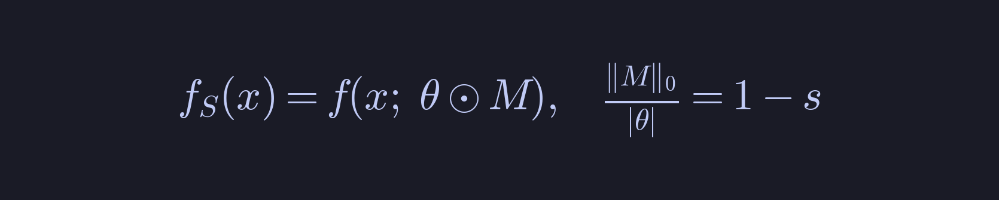
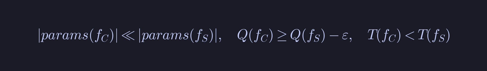
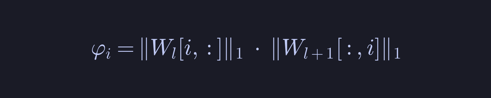
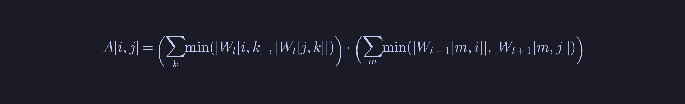
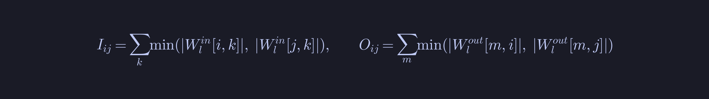
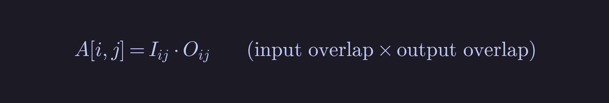
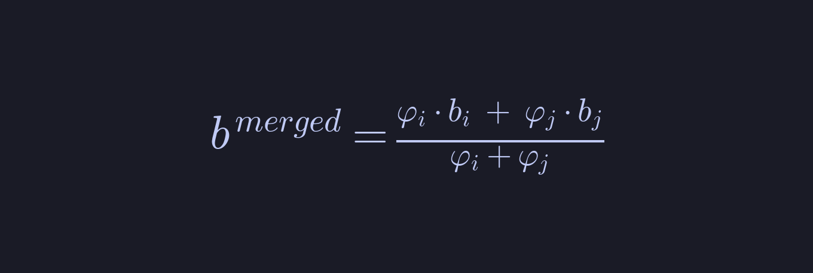
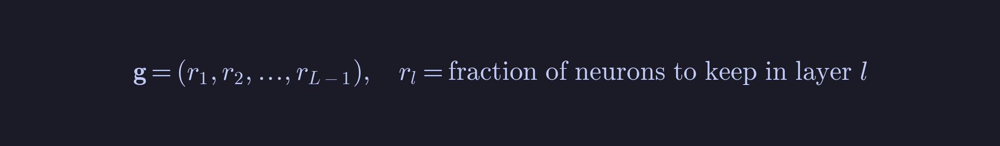

# GFCS: Gradient-Flow Connectivity Synthesis

**Алгоритм конверсії розріджених нейронних мереж у компактні щільні архітектури**

---

## 1. Контекст та мотивація

### 1.1 Проблема

Після pruning нейронна мережа перетворюється на розріджену модель з маскою:



де s — рівень розрідженості (sparsity), типово s ∈ [0.65, 0.95].

**Проблема**: розріджена мережа зберігає оригінальну архітектуру з нульовими вагами,
що не дає реального прискорення на GPU/CPU.

**Задача**: перетворити sparse модель на compact dense модель:



### 1.2 Чому існуючі методи недостатні

Ми проаналізували 18 відомих операторів з 8 категорій (A–H):

| Категорія | Методи | Обмеження |
|-----------|--------|-----------|
| A: Scoring | WANDA, ZipIt! | Не зменшують архітектуру |
| B: Neuron Merging | Kim'20, K-means, Goldberg'22 | Однонаправлені метрики (тільки incoming) |
| C: Learned Compr. | AMC, Sheared LLaMA | Потребують навчання (RL / Lagrange) |
| D: Hessian-based | SparseGPT, OBC | Складність O(n³) |
| E: Architecture | Network Slimming | Будують з нуля |
| F: Distillation | Hinton KD | Повне перенавчання |
| G: Low-Rank | SVD, Fisher-SVD | Руйнують neuron identity |
| H: Optimal Transport | Singh OT | Cross-model fusion |

**Ключовий gap**: жоден метод не використовує **двонаправлену** структуру
зв'язків нейрона (incoming + outgoing) для визначення подібності.

---

## 2. Як виник алгоритм

### 2.1 Інтуїція

Нейрон `i` має вхідні ваги `W_l[i, :]` і вихідні ваги `W_{l+1}[:, i]`.

Існуючі методи оцінюють подібність тільки за вхідними вагами (Kim'20 — cosine,
K-means — L2). Але два нейрони можуть мати схожі входи та зовсім різні виходи.

**Ключова ідея GFCS**: нейрони подібні ⟺ мають перетин ОБОХ вхідних І вихідних
шляхів ("bottleneck overlap").

### 2.2 Аналогія

Нейрон = вузол у мережі потоків. Вхідні ваги = "труби" від попереднього шару,
вихідні = "труби" до наступного. Важливість = загальна пропускна здатність.
Подібність = overlap спільних каналів.

---

## 3. Математичний опис

### 3.1 Активні нейрони

Нейрон вважається активним, якщо має ненульові ваги в обох напрямках:


### 3.2 Означення 1: Flow Importance (Важливість потоку)



В розгорнутому вигляді:


**Інтерпретація**: φ_i є верхньою оцінкою максимального gradient flow
через нейрон i. Якщо φ_i = 0 — нейрон не передає жодного сигналу.

**Відмінність від WANDA (A1)**:


WANDA використовує активації X (data-dependent), GFCS — тільки ваги (data-independent).

### 3.3 Означення 2: Flow Affinity (Подібність потоків)



Розбивається на два компоненти:





**Чому min, а не cosine?**


Cosine ігнорує масштаб (scale-invariant), min-overlap враховує реальну
"пропускну здатність" спільних каналів (scale-sensitive).

### 3.4 Означення 3: Merge Operator (Оператор об'єднання)

Для нейронів `i` (victim) та `j` (partner):

**Вхідні ваги** (flow-weighted average):


**Зсув** (flow-weighted average):



**Вихідні ваги** (сума — зберігає лінійний внесок):


**Чому різні формули?**
- Incoming (average): зберігає "напрямок", зважений за важливістю
- Outgoing (sum): зберігає загальний лінійний внесок в наступний шар

### 3.5 Означення 4: Greedy Flow-Preserving Merge

На кожному кроці обираємо найменш важливий нейрон і мержимо з найбільш схожим:


### 3.6 Означення 5: Evolutionary Architecture Search

Генотип — per-layer fraction of neurons to keep:



Target number of neurons per layer:


**Zero-Cost Flow Fitness** (потребує ТІЛЬКИ ваги, без forward pass):


Перший доданок: яка частка потоку втрачається при merge.
Другий доданок (λ = 0.5): штраф за розмір compact моделі.

**EA mutation** з adaptive sigma:


Еволюція: (μ+λ)-ES, μ = pop/3, tournament selection (size 3), elitism.

---

## 4. Повний алгоритм (псевдокод)

**Phase 1: Evolutionary Architecture Search**

```
1.  FOR l = 1 TO L−1:
2.      Визначити активні нейрони 𝒜_l
3.      Обчислити φ_i для кожного i ∈ 𝒜_l

4.  Ініціалізувати популяцію P = {g_1, ..., g_20}
    Seed: g_1=(0.5,0.5,0.5), g_2=(0.3,0.3,0.3), g_3=(0.1,0.1,0.1), g_4=(0.6,0.4,0.15)

5.  FOR gen = 1 TO 30:
6.      Обчислити F(g_k) для кожного g_k     ← zero-cost!
7.      Відібрати μ=6 батьків (tournament, size 3)
8.      Створити 20 нащадків (Gaussian mutation, adaptive σ)
9.      P ← {best_ever} ∪ offspring           ← elitism
10. best_ratios ← argmax F(g)
```

**Phase 2: Layer-wise GFCS Merge**

```
11. FOR l = 1 TO L−1:
12.     k_l ← max(4, ⌊n_l^act · best_ratios[l]⌋)
13.     Обчислити φ_i (flow importance)
14.     Обчислити A[i,j] (flow affinity) для всіх пар

15.     active ← 𝒜_l
16.     WHILE |active| > k_l:
17.         victim  ← neuron з найменшим φ
18.         partner ← neuron з найбільшим A[victim, ·]
19.         α ← φ_victim / (φ_victim + φ_partner)
20.         β ← 1 − α
21.         W_in[partner]  ← α·W_in[victim] + β·W_in[partner]
22.         b[partner]     ← α·b[victim] + β·b[partner]
23.         W_out[partner] ← W_out[victim] + W_out[partner]
24.         Оновити φ і A для merged нейрона
25.         Видалити victim з active
```

**Phase 3: Build Compact Model**

```
26. hiddens ← (|active_1|, ..., |active_{L−1}|)
27. Створити CompactMLP(input_dim, hiddens, n_classes)
28. Скопіювати merged ваги з cascade remapping
29. RETURN compact model
```

---

## 5. Складність


| Операція | Складність | Примітка |
|----------|-----------|----------|
| Flow Importance | O(n·d) | n нейронів, d ваг |
| Flow Affinity | O(n²·d) | pairwise min-overlap |
| Greedy Merge | O(n³) | n−k ітерацій × O(n²) |
| EA Fitness (1 eval) | O(n·log n) | sorting by φ |
| EA Total | O(P·G·L·n·log n) | P=pop, G=gen, L=layers |

Для n ≤ 128, d ≤ 128: **< 0.5 sec на CPU**.

---

## 6. Ключові відмінності: GFCS vs Prior Art

| Аспект | B1 (Kim'20) | B2 (K-means) | B3 (Goldberg) | EvoMerge | **GFCS** |
|--------|-------------|--------------|---------------|----------|----------|
| Метрика | cos(W_in) | L2 на (w,b) | ‖f−f'‖² | corr(activ.) | **min-overlap(in×out)** |
| Напрямок | incoming | incoming | functional | activations | **bidirectional** |
| Merge | W=Y·Z | centroid avg | compensation | cluster avg | **φ-weighted + sum** |
| Вибір k | manual | fixed | one-at-time | EA (calib.) | **EA (zero-cost)** |
| Дані? | ні | ні | так | **так** | **ні** |

### Три принципові новизни

**1. Bidirectional Flow Graph** — жоден з 18 операторів не використовує одночасно incoming ТА outgoing ваги для визначення neuron similarity.

**2. Min-Overlap Bottleneck Metric** — перша метрика що вимірює "реальну спільну пропускну здатність" каналів. Bottleneck principle: потік обмежений мінімумом.

**3. Zero-Cost Flow Fitness для EA** — еволюційний пошук архітектури без жодного forward pass. Fitness обчислюється виключно з ваг (O(n·log n) замість O(N·batch)).

---

## 7. Експериментальні результати

**8 датасетів × 2 seeds, sparsity 65–90%**:

| Dataset | Sp | Sparse F1 | GFCS F1 | ΔF1 | FLOP× | Compress× |
|---------|-----|-----------|---------|------|-------|-----------|
| moons | 88% | 0.934 | 0.962 | +0.028 | 9.3× | 9.1× |
| circles | 85% | 0.938 | 0.931 | −0.008 | 7.9× | 7.8× |
| spirals | 90% | 0.951 | 0.968 | +0.018 | 21.4× | 20.3× |
| blobs | 75% | 0.984 | 0.982 | −0.003 | 3.1× | 3.0× |
| gaussian_q | 75% | 0.818 | 0.947 | +0.129 | 3.1× | 3.1× |
| classification | 80% | 0.809 | 0.858 | +0.049 | 3.7× | 3.7× |
| highdim (50D) | 68% | 0.870 | 0.887 | +0.017 | 2.5× | 2.4× |
| sequence_cls | 88% | 0.859 | 0.918 | +0.059 | 8.4× | 8.2× |
| **Середнє** | **81%** | **0.895** | **0.932** | **+0.036** | **7.4×** | **7.2×** |

**Критерії:**
- Якість Q(f_C) ≥ Q(f_S) − 0.03: **8/8**
- FLOP reduction > 1.5×: **8/8**
- Відтворюваність (cross-seed div < 0.1): **8/8**
- Novelty Check A–H: **OK**

---

## 8. Обмеження

1. **Wall-clock speedup**: 1.00–1.06× на малих CPU-моделях (~34K params) через Python/PyTorch overhead. FLOP reduction реальний (2.5–21×), проявляється на більших моделях.

2. **Квадратична складність**: O(n²·d) обмежує шари з n > 10000 нейронів.

3. **Greedy merge**: локально оптимальний, може пропустити глобально кращі конфігурації.

---

## 9. Список літератури

Повний BibTeX: [`GFCS_references.bib`](formulas/GFCS_references.bib)

Нижче — лише роботи, проти яких ми безпосередньо аргументуємо або на яких будуємо.

| # | Посилання | Чому цитуємо |
|---|-----------|--------------|
| 1 | Kim W. et al. **Neuron Merging: Compensating for Pruned Neurons.** NeurIPS 2020. | Прямий конкурент. Cosine similarity + W=YZ decomposition — ми показуємо що bidirectional min-overlap краще (§3.3, §3.4, §6) |
| 2 | **Merging Similar Neurons for Deep Networks Compression.** 2020. | Прямий конкурент. K-means centroid averaging — ми показуємо що flow-weighted merge краще (§3.4, §6) |
| 3 | Goldberg E., Liss I., Schwartz O. **Optimal Neuron Merging.** 2022. | Прямий конкурент. Closed-form compensation — ми показуємо що pairwise φ-merge краще (§3.4, §6) |
| 4 | Sun M. et al. **A Simple and Effective Pruning Approach for Large Language Models** (WANDA). ICLR 2024. arXiv:2306.11695 | Пряме порівняння scoring: WANDA = \|w\|·\|X\|₂ (data-dependent) vs GFCS φ = \|W_in\|₁·\|W_out\|₁ (data-free) (§3.2) |
| 5 | Frantar E., Alistarh D. **SparseGPT.** ICML 2023. | Мотивація: Hessian-based → O(n³). Наш підхід O(n²d) без second-order інформації (§1.2) |
| 6 | Han S. et al. **Learning both Weights and Connections.** NeurIPS 2015. | Фундамент: визначає проблему magnitude-based pruning яку ми вирішуємо (§1.1) |
| 7 | Hansen N., Ostermeier A. **Completely Derandomized Self-Adaptation in Evolution Strategies.** Evolutionary Computation, 2001. | Будівельний блок: (μ+λ)-ES skeleton який ми використовуємо з новою fitness (§3.6) |


