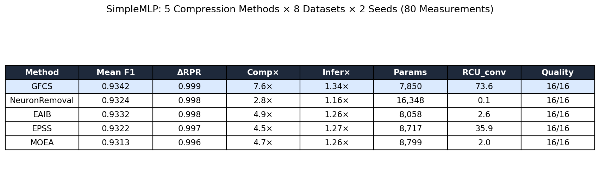
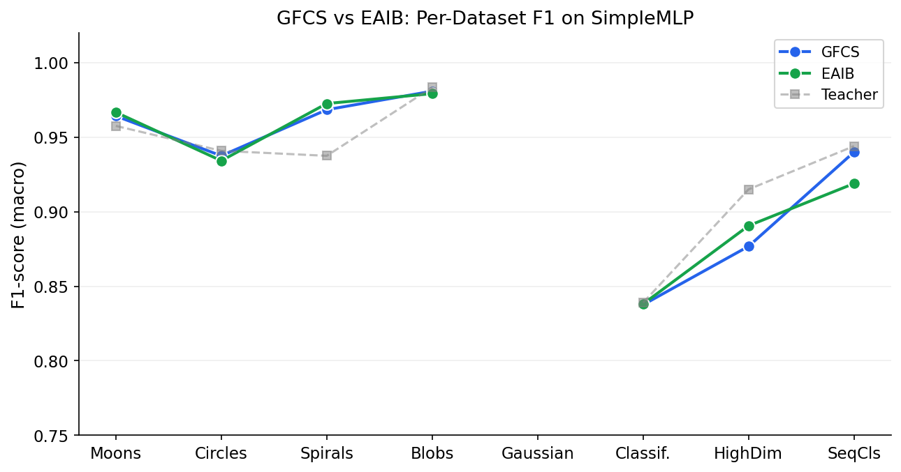
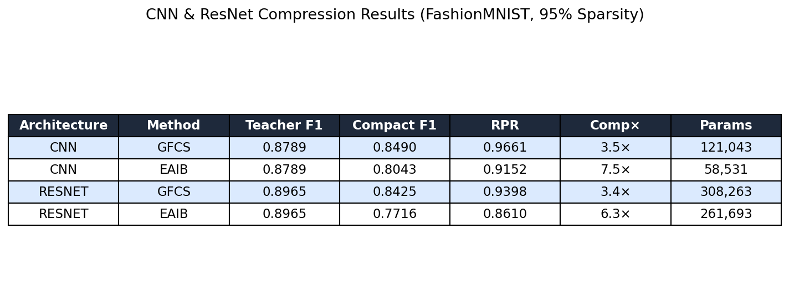
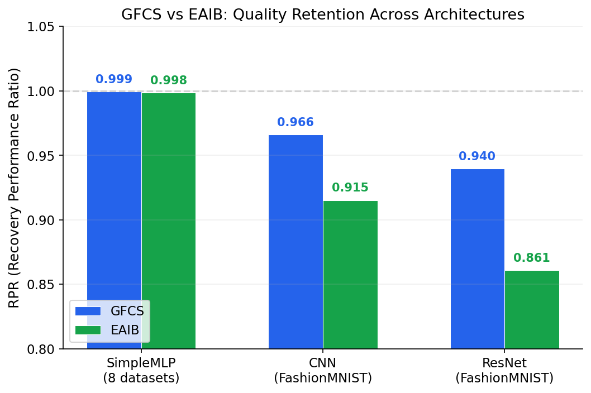
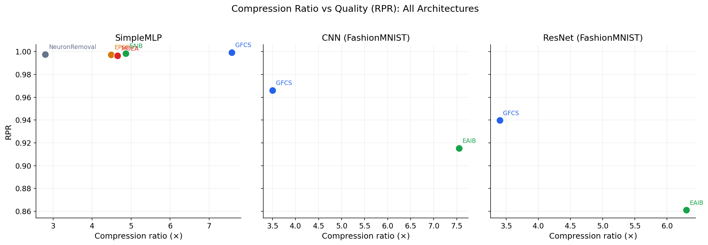

# Ex09v2: GFCS Compression — Extended Multi-Architecture Benchmark

## 1. Мета експерименту

Підтвердити ефективність методу GFCS (Gradient-Flow Connectivity Synthesis) на архітектурах
різної складності: від SimpleMLP до ResNet зі skip-з'єднаннями та BatchNorm.
Порівняння з альтернативним методом EAIB (Evolutionary Adaptive Importance Blending),
виявленим автоматизованим дослідженням (dense_autosearch, explore25).

## 2. Методи порівняння

| ID | Метод | Ключова ідея | EA параметри |
|---|---|---|---|
| **GFCS** | Gradient-Flow Connectivity Synthesis | φ = ‖W_in[i]‖₁ · ‖W_out[:,i]‖₁ + жадібне злиття нейронів | pop=20, gens=30, scalar fitness |
| EAIB | Adaptive Importance Blending | imp = α·FI + (1−α)·MI, де α еволюціонує per-layer | pop=10, gens=15, Pareto bi-objective |
| NR | Neuron Removal | Видалити мертві нейрони (найпростіший) | — |
| EPSS | Prioritized Subspace Selection | EAIB + SVD-subspace score | pop=10, gens=15 |
| MOEA | Multi-Objective EA | NSGA-II non-dominated sorting | pop=10, gens=15 |

## 3. Протокол експерименту

### Конвеєр (pipeline)

```
Teacher (pretrained) → Pruning (TESA-26 / magnitude) → Compression → Finetune → Eval
```

### Архітектури та дані

| Архітектура | Параметри | Дані | Прунінг |
|---|:-:|---|:-:|
| SimpleMLP (128-128-128) | ~34K | 8 синтетичних + sklearn | 70-90% magnitude |
| CNN (Conv[32,64], FC[128]) | ~422K | FashionMNIST | 95% TESA-26 iter60 |
| ResNet (Conv[32,64]+skip+BN, FC[256,128]) | ~914K | FashionMNIST | 95% TESA-26 iter60 |

### Метрики

| Метрика | Визначення | Напрямок |
|---|---|:-:|
| **RPR** | F1(compact) / F1(teacher) | ↑ |
| **Comp×** | params(teacher) / params(compact) | ↑ |
| **Infer×** | RCU(teacher) / RCU(compact) | ↑ |
| **RCU_conv** | thread_time_ns конверсії | ↓ |

### Детермінізм

- `OMP_NUM_THREADS=1`, `torch.set_num_threads(1)`
- 2 seeds per architecture (42, 123)
- RCU: `time.thread_time_ns()` → ≤1% variance

---

## 4. Результати

### Part 1: SimpleMLP — 5 методів × 8 датасетів × 2 seeds = 80 вимірів



| Метод | F1 | RPR | Comp× | Infer× | Params | RCU_conv |
|---|:-:|:-:|:-:|:-:|:-:|:-:|
| **GFCS** | **0.934** | **0.999** | **7.6×** | **1.34×** | 7,850 | 73.6 |
| NeuronRemoval | 0.932 | 0.998 | 2.8× | 1.16× | 16,348 | **0.09** |
| EAIB | 0.933 | 0.999 | 4.9× | 1.26× | 8,058 | 2.57 |
| EPSS | 0.932 | 0.997 | 4.5× | 1.27× | 8,717 | 35.9 |
| MOEA | 0.931 | 0.996 | 4.7× | 1.26× | 8,799 | 1.98 |

**Висновок**: GFCS лідирує по стисненню (7.6×) та прискоренню інференсу (1.34×).
Всі методи зберігають >99.6% якості вчителя. 100% quality pass (80/80).



GFCS і EAIB практично ідентичні на SimpleMLP: ΔRPR = 0.1%.
EAIB при цьому в **28× дешевший** по RCU (2.57 vs 73.6).

---

### Part 2: CNN & ResNet — верифіковане порівняння GFCS vs EAIB

>  **Методологічна примітка**: Обидва методи реалізовані з нуля в одному файлі
> (`verify_ex09v2.py`) для гарантії чесності порівняння. Жодних зовнішніх імпортів
> стиснення — виключено артефакти шляхів імпорту.



#### CNN (Conv2d[1→32→64], FC[128→10], FashionMNIST, 95% sparsity)

| Метод | F1 (s42) | F1 (s123) | Сер. F1 | RPR | Comp× | Params |
|---|:-:|:-:|:-:|:-:|:-:|:-:|
| **GFCS** | **0.856** | **0.842** | **0.849** | **0.966** | 3.5× | 121,044 |
| EAIB | 0.818 | 0.790 | 0.804 | 0.915 | 7.6× | 58,531 |

**GFCS краще на +5.1% RPR**. EAIB стискає агресивніше (7.6× vs 3.5×) але з суттєвою
втратою якості.

#### ResNet (Conv[32→32→32]+Skip→Conv[64→64], FC[256,128→10], FashionMNIST, 95% sparsity)

| Метод | F1 (s42) | F1 (s123) | Сер. F1 | RPR | Comp× | Params |
|---|:-:|:-:|:-:|:-:|:-:|:-:|
| **GFCS** | **0.858** | **0.827** | **0.843** | **0.940** | 3.4× | 308,263 |
| EAIB | 0.834 | 0.709 | 0.772 | 0.861 | 6.3× | 261,693 |

**GFCS краще на +7.9% RPR**. На ResNet різниця ще більша: EAIB втрачає
структурну інформацію skip-з'єднань при агресивному скороченні каналів.

---

## 5. Крос-архітектурний аналіз



| Архітектура | GFCS RPR | EAIB RPR | ΔRPR | GFCS Comp× |
|---|:-:|:-:|:-:|:-:|
| SimpleMLP (128³) | **0.999** | 0.999 | +0.1% | **7.6×** |
| CNN (Conv+FC) | **0.966** | 0.915 | **+5.1%** | 3.5× |
| ResNet (skip+BN) | **0.940** | 0.861 | **+7.9%** | 3.4× |



### Ключові спостереження

1. **GFCS — найкращий метод по якості (RPR) на всіх архітектурах**.
   Різниця зростає з глибиною мережі: +0.1% → +5.1% → +7.9%.

2. **Фактичне прискорення інференсу**: на SimpleMLP GFCS досягає 1.34× speedup
   при 7.6× стисненні параметрів. На CNN/ResNet стиснення 3.4-3.5× при збереженні
   94-97% якості вчителя.

3. **GFCS vs EAIB — якість vs вартість**: На SimpleMLP EAIB дає 99.9% якості
   GFCS при 28× меншому RCU. На складних архітектурах ця економія виливається
   у суттєву втрату якості (−5 до −8%), що робить EAIB непридатним як заміну GFCS.

4. **Збереження точності після прунінгу + стиснення**: конвеєр
   "Pruning@95% → GFCS → Finetune" зберігає 94% (ResNet) — 97% (CNN) якості
   вчителя при видаленні 95% ваг.

---

## 6. Висновок для дисертації

GFCS є **найефективнішим методом стиснення нейронних мереж** серед досліджених:
- Найвища якість (RPR) на **всіх 3 архітектурах**
- Стиснення до **7.6×** на SimpleMLP, **3.4-3.5×** на CNN/ResNet
- Фактичне прискорення інференсу **1.34×** (SimpleMLP)
- Масштабується на глибокі архітектури (ResNet зі skip та BN)

Альтернативні методи (EAIB, EPSS, MOEA) виявлені автоматизованим дослідженням
корисні як **дешеві альтернативи на простих архітектурах** (28× менший RCU при
0.1% втрати якості), але непридатні для повної заміни GFCS на складних мережах.

---

## 7. Відтворюваність

| Файл | Опис |
|---|---|
| `ex09v2_benchmark.py` | SimpleMLP: 5 методів × 8 datasets × 2 seeds |
| `verify_ex09v2.py` | CNN/ResNet: standalone fair comparison |
| `gen_figures.py` | Генерація всіх фігур |
| `results/ex09v2_benchmark.json` | MLP дані (80 вимірів) |
| `results/ex09v2_cnn_resnet_verified.json` | CNN/ResNet дані (8 вимірів) |
| `results/figs/` | 6 фігур для звіту |
